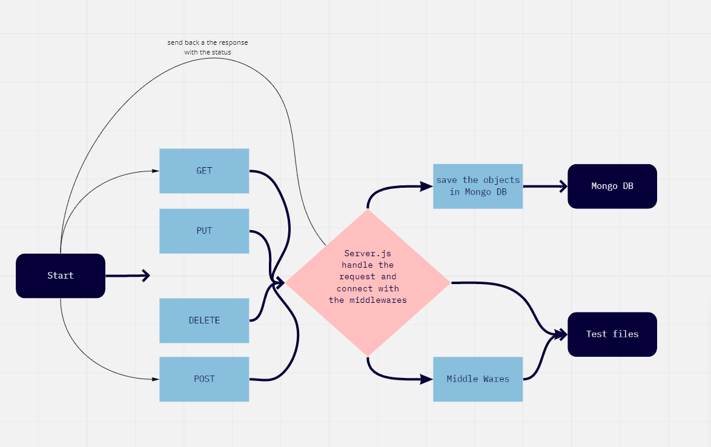

# api-server

Author:Malek Hassan Hasan Al-Dalal'ah

## Overview

Build a simple API (with no code) to gain some clarity and visuals on proper route structure and the data contracts. We will use a product called ‘json-server’ to build a simple API server

## Prerequisites

- Operating system: Mac OS, Windows, Linux
- Git
  Follow the instruction in the links below to install git in your machine
  - [Windows](https://git-scm.com/download/win)
  - [Mac OS](https://git-scm.com/download/mac)
  - [Linux](https://git-scm.com/download/linux)
- [Codeing Editor](https://www.wpbeginner.com/showcase/12-best-code-editors-for-mac-and-windows-for-editing-wordpress-files/)

## Getting Started

These instructions will get you a copy of the project up and running on your local machine for development and testing purposes. See deployment for notes on how to deploy the project on a live system.

## Installation

1. open your terminal

2. Clone the repo

git clone https://github.com/401-advanced-javascript-MalekHassan/api-server.git

## Usage

```cmd
npm i supertest
npm i jest
npm i express
dotenv
```

## Architecture

This application was build with Node.js and it includes:

# UML diagram



## Change Log

23-10-2020 11:25pm - you can add a note.
